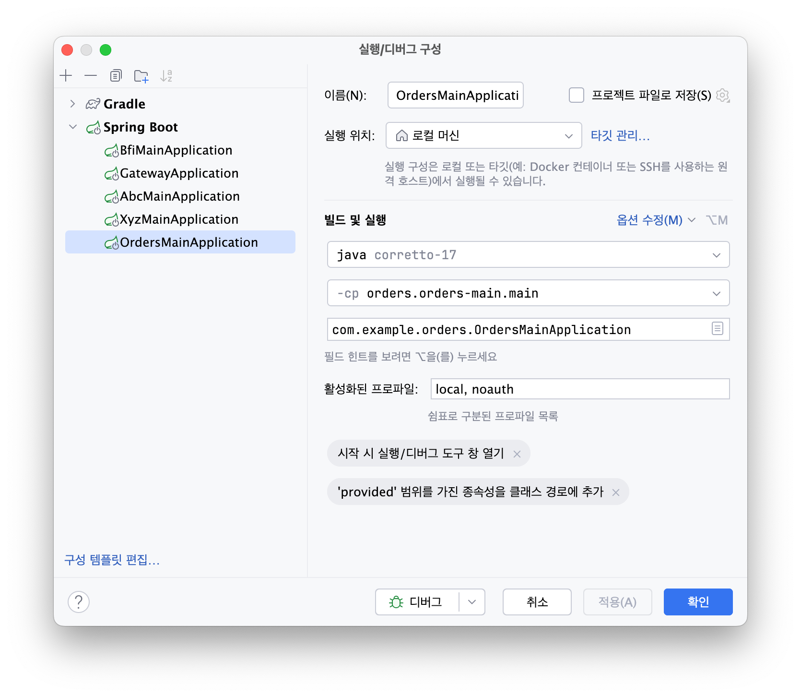

# 로컬 개발 환경

<!-- TOC -->
* [로컬 개발 환경](#로컬-개발-환경)
  * [1. local 개발 환경 준비](#1-local-개발-환경-준비)
    * [1.1. local 개발환경 다이어그램](#11-local-개발환경-다이어그램)
    * [1.2. local 개발환경](#12-local-개발환경)
      * [1.2.1. docker-compose 명령어](#121-docker-compose-명령어)
      * [1.2.2. local환경 end-point list](#122-local환경-end-point-list)
  * [2. 마이크로서비스별](#2-마이크로서비스별)
    * [2.1 공통](#21-공통)
      * [2.1.1. versions](#211-versions)
      * [2.1.2. Back-end 프로젝트 구조 및 패키지경로](#212-back-end-프로젝트-구조-및-패키지경로)
      * [2.1.3. Build](#213-build)
      * [2.1.4. Run](#214-run)
    * [2.2. Backend](#22-backend)
      * [2.2.1. Orchestration Saga Pattern](#221-orchestration-saga-pattern)
      * [2.2.2. Resilience4](#222-resilience4)
      * [샘플](#샘플)
    * [2.3. BFI](#23-bfi)
      * [2.3.1. MongoDB](#231-mongodb)
    * [2.4. BFF](#24-bff)
  * [4. TODO](#4-todo)
  * [5. 참고](#5-참고)
<!-- TOC -->

## 1. local 개발 환경 준비

### 1.1. local 개발환경 다이어그램



### 1.2. local 개발환경

* 호스트 등록이 안되어 있으면 따로 등록 해야 합니다. (kafka 접속이 local에서 안되는 문제가 있어요.)
  ````shell
  sudo vi /etc/hosts
  127.0.0.1 kubernetes.docker.internal
  ````

#### 1.2.1. docker-compose 명령어

* 실행중인 docker-compose container 를 내리고 삭제한다.
  ````
  docker-compose down -v
  ````
* 형상이 변경된 image가 있을 경우 다시 빌드한다.
  ````
  docker-compose build
  ````
* docker-compose 를 실행한다.
  ````
  docker-compose up -d
  ````
* docker-compose 를 실행한다.
  ````
  docker-compose up -d
  ````
* docker-compose 실행여부를 확인한다.
  ````
  docker-compose ps -a
  docker-compose stats
  ````
* docker-compose 로그를 확인한다.
  ````
  docker-compose logs -f
  docker-compose logs -f <서비스명>
  ````

#### 1.2.2. local환경 end-point list

| 구분             | endpoint                                                                                                                                                               | id / pw                                     | 기타                                                                                    |
|----------------|------------------------------------------------------------------------------------------------------------------------------------------------------------------------|---------------------------------------------|---------------------------------------------------------------------------------------|
| nginx          | http://localhost/services/abc/swagger-ui/index.html<br/>http://localhost/services/xyz/swagger-ui/index.html<br/>http://localhost/services/orders/swagger-ui/index.html | user / user                                 |                                                                                       |
| keycloak       | https://auth.xr-friends.com/ev/                                                                                                                                        | admin / ev123                               | issuer-uri: https://auth.xr-friends.com/ev/realms/example                             |
| kafka ui       | http://localhost:3030/                                                                                                                                                 |                                             |                                                                                       |
| mysql          | localhost:3306                                                                                                                                                         | mysqluser / mysqlpw<br/>root / rootpassword |                                                                                       |
| mongodb        | localhost:27017                                                                                                                                                        | root / example                              |                                                                                       |
| mongo express  | http://localhost:8088/db/bfi/                                                                                                                                          | admin / pass                                |                                                                                       |
| Zipkin         | http://localhost:9411/zipkin/                                                                                                                                          |                                             | service tracing                                                                       |
| AbcService     | http://localhost:8082/services/abc/swagger-ui/index.html                                                                                                               |                                             | post method가 호출되면 Abc 등록 후 Xyz도 등록 Command를 호출한다.                                     |
| XyzService     | http://localhost:8083/services/xyz/swagger-ui/index.html                                                                                                               |                                             |                                                                                       |
| OrderService   | http://localhost:8084/services/orders/swagger-ui/index.html                                                                                                            |                                             | post method가 호출되면 order를 등록 후 SAGA패턴을 사용하여 Abc,Xyz 서비스를 호출하여 등록하고 완료시 order 상태를 변경한다. |
| BfiService     | http://localhost:8085/services/bfi/swagger-ui/index.html                                                                                                               |                                             |                                                                                       |
| GatewayService | http://localhost:8090/                                                                                                                                                 |                                             |                                                                                       |
| BffService     | http://localhost:8091/services/bff/swagger-ui/index.html                                                                                                               |                                             |                                                                                       |

## 2. 마이크로서비스별

### 2.1 공통

#### 2.1.1. versions

* Java : JDK 17 LTS
* SpringBoot : 3.2.4
* SpringCloud : 2023.0.1
* eventuateTram : 0.34.0.RELEASE
* eventuateSaga : 0.23.0.RELEASE
* resilience4j : 2.2.0
* openfeign : 13.2
* openapi : 3.0.0
* mapstruct : 1.5.5.Final
* springdoc-openapi-webmvc : 2.2.0

#### 2.1.2. Back-end 프로젝트 구조 및 패키지경로

* xxxxx Project : com.hae.ecsp.xxxxx
  * sub projtect : xxxxx-share
    * domain
      * dto
    * eventuate
      * command
      * event
  * sub project : xxxxx-main
    * client
    * config
    * domain
      * entity
    * eventuate
    * repository
    * security
    * service
      * impl
      * mapper
    * util
    * web
      * rest
      * websocket

#### 2.1.3. Build

* common
  * common build
    ````
    ./gradlew jar
    ````
  * common publishing
    ````
    ./gradlew publishToMavenLocal
    ````
* share module build
  * build
    ````
    ./gradlew jar
    ````
  * publishing
    ````
    ./gradlew publishToMavenLocal
    ````
* main module build
  * build
    ````
    ./gradlew bootJar
    ````
  * run
    ````
    ./gradlew bootRun
    ````

#### 2.1.4. Run

* 인증없이 실행
  * 실행시 profile 에 **noauth** 를 넣습니다. (profile은 복수개 지정 가능합니다. 콤마로 구분)
  
* 인증 실행
  * noauth 가 지정되지 않으면 인증 api 호출시 인증을 체크합니다.
  * 향후 gateway -> bff -> backend 의 구조로 호출하면 로그인 후 인증이 가능해집니다.
  * spring security 권한 샘플 완료시 가이드 예정입니다. 

### 2.2. Backend

#### 2.2.1. Orchestration Saga Pattern

샘플은 orders-main 프로젝트의 CreateOrdersSaga.java 를 참고합니다.
아래 예와 같이 Saga를 step() 단위로 정의하고, 호출할 command 와 오류처리 및 응답에 대한 처리를 합니다.

````java
    private SagaDefinition<Orders> sagaDefinition =
        step()
          .invokeLocal(this::create)
          .withCompensation(this::reject)
        .step()
          .invokeParticipant(this::abcRegisterCommand)
            .onReply(AbcDTO.class, this::handleAbcReply)
          .withCompensation(this::abcRegisterCommand4Close)
        .step()
          .invokeParticipant(this::xyzRegisterCommand)
          .onReply(XyzDTO.class, this::handleXyzReply)
          .onReply(Exception.class, this::handleAccountException)
        .step()
          .invokeLocal(this::approve)
        .build()
        ;
````

#### 2.2.2. Resilience4

샘플은 orders-main 프로젝트의 AbcServiceClient.java, XyzServiceClient.java 를 참고합니다.

참고사이트
* http://xr-friends.com/spring-boot-resilience/
* http://xr-friends.com/resilience4j2/
* http://xr-friends.com/resilience4jfeign/
* https://github.com/resilience4j/resilience4j

#### 샘플

* 의존성 주입
````groovy
    // openfeign _ resilience4j
    implementation "io.github.resilience4j:resilience4j-spring-boot3:${resilience4jVersion}"
    implementation "io.github.resilience4j:resilience4j-all:${resilience4jVersion}"
    implementation "io.github.resilience4j:resilience4j-feign:${resilience4jVersion}"
    implementation "io.github.openfeign:feign-core:${openfeignVersion}"
    implementation "io.github.openfeign:feign-jackson:${openfeignVersion}"
    implementation "io.github.openfeign:feign-httpclient:${openfeignVersion}"
````

* application.yml
````yaml
resilience4j.circuitbreaker:
  configs:
    default:
      registerHealthIndicator: true
      slidingWindowSize: 10
      minimumNumberOfCalls: 5
      permittedNumberOfCallsInHalfOpenState: 3
      automaticTransitionFromOpenToHalfOpenEnabled: true
      waitDurationInOpenState: 5s
      failureRateThreshold: 50
      eventConsumerBufferSize: 10
      recordExceptions:
        - org.springframework.web.client.HttpServerErrorException
        - java.util.concurrent.TimeoutException
        - java.io.IOException
      ignoreExceptions:
        - com.example.orders.exception.BadRequestAlertException
    shared:
      slidingWindowSize: 100
      permittedNumberOfCallsInHalfOpenState: 30
      waitDurationInOpenState: 1s
      failureRateThreshold: 50
      eventConsumerBufferSize: 10
      ignoreExceptions:
        - com.example.orders.exception.BadRequestAlertException
  instances:
    keycloakClient:
      baseConfig: default
    abcServiceClient:
      baseConfig: default
    xyzServiceClient:
      baseConfig: default

resilience4j.retry:
  configs:
    default:
      maxAttempts: 3
      waitDuration: 100
      retryExceptions:
        - org.springframework.web.client.HttpServerErrorException
        - java.util.concurrent.TimeoutException
        - java.io.IOException
      ignoreExceptions:
        - com.example.orders.exception.BadRequestAlertException
  instances:
    keycloakClient:
      baseConfig: default
    abcServiceClient:
      baseConfig: default
    xyzServiceClient:
      baseConfig: default

resilience4j.bulkhead:
  configs:
    default:
      maxConcurrentCalls: 100
  instances:
    keycloakClient:
      baseConfig: default
    abcServiceClient:
      baseConfig: default
    xyzServiceClient:
      baseConfig: default

resilience4j.thread-pool-bulkhead:
  configs:
    default:
      maxThreadPoolSize: 4
      coreThreadPoolSize: 2
      queueCapacity: 2
  instances:
    keycloakClient:
      baseConfig: default
    abcServiceClient:
      baseConfig: default
    xyzServiceClient:
      baseConfig: default

resilience4j.ratelimiter:
  configs:
    default:
      registerHealthIndicator: false
      limitForPeriod: 10
      limitRefreshPeriod: 1s
      timeoutDuration: 0
      eventConsumerBufferSize: 100
  instances:
    keycloakClient:
      baseConfig: default
    abcServiceClient:
      baseConfig: default
    xyzServiceClient:
      baseConfig: default

resilience4j.timelimiter:
  configs:
    default:
      cancelRunningFuture: false
      timeoutDuration: 2s
  instances:
    keycloakClient:
      baseConfig: default
    abcServiceClient:
      baseConfig: default
    xyzServiceClient:
      baseConfig: default

client:
  abcService:
    name: abcServiceClient
    uri: http://localhost:8082
````
* Client 정의
````java
package com.example.orders.client;

import com.example.abc.domain.dto.AbcDTO;
import feign.Headers;
import feign.Param;
import feign.RequestLine;

import java.util.List;

public interface AbcServiceClient {
    @RequestLine("POST /services/abc/api/abcs")
    @Headers("Content-Type: application/json")
    AbcDTO createAbc(AbcDTO abcDTO);

    @RequestLine("PATCH /services/abc/api/abcs/{id}")
    @Headers("Content-Type: application/json")
    AbcDTO partialUpdateAbc(@Param("id") String id, AbcDTO abcDTO);

    @RequestLine("DELETE /services/abc/api/abcs/{id}")
    @Headers("Content-Type: application/json")
    void deleteAbc(@Param("id") String id);

    @RequestLine("GET /services/abc/api/abcs")
    @Headers("Content-Type: application/json")
    List<AbcDTO> getAllAbcs();

    @RequestLine("GET /services/abc/api/abcs/{id}")
    @Headers("Content-Type: application/json")
    AbcDTO getAbc(@Param("id") String id);
}
````

* Instance 생성
  Json 처리를 위해 ObjectMapper를 상대 API에 맞게 생성하여 주입한다.
````java
public class AbcServiceImpl implements AbcService {

    private final AbcServiceClient abcServiceClient;

    private final String name;
    private final String uri;

    public AbcServiceImpl(@Value("${client.abcService.name}") String name,
                          @Value("${client.abcService.uri}") String uri) {

        this.name = name;
        this.uri = uri;

        CircuitBreaker circuitBreaker = CircuitBreaker.ofDefaults(name);
        RateLimiter rateLimiter = RateLimiter.ofDefaults(name);
        FeignDecorator decorator = FeignDecorators.builder()
                .withCircuitBreaker(circuitBreaker)
                .withRateLimiter(rateLimiter)
                .build();

        ObjectMapper objectMapper = new ObjectMapper()
                .setPropertyNamingStrategy(PropertyNamingStrategy.LOWER_CAMEL_CASE)
                .setVisibility(PropertyAccessor.FIELD, JsonAutoDetect.Visibility.ANY)
                .setSerializationInclusion(JsonInclude.Include.NON_NULL)
                .configure(SerializationFeature.WRITE_SINGLE_ELEM_ARRAYS_UNWRAPPED, false)
                .configure(DeserializationFeature.ACCEPT_SINGLE_VALUE_AS_ARRAY, true)
                .configure(DeserializationFeature.FAIL_ON_UNKNOWN_PROPERTIES, true)
                .registerModule(new JavaTimeModule());

        this.abcServiceClient = Resilience4jFeign.builder(decorator)
                .encoder(new JacksonEncoder(objectMapper))
                .decoder(new JacksonDecoder(objectMapper))
                .target(AbcServiceClient.class, uri);
    }

    @Override
    public AbcDTO createAbc(AbcDTO abcDTO) {
        try {
            return abcServiceClient.createAbc(abcDTO);
        } catch (FeignException err) {
            if (err.status() == 401) {
//                clearToken();
            }
//            err.printStackTrace();
//            return null;
            throw err;
        }
    }
}
````

* 사용
````java
@RequiredArgsConstructor
public class Sample {
    private final AbcService abcService;

    public AbcDTO callAbc(String id) {
        return abcService.getAbc(id);
    }
}
````

### 2.3. BFI

BFI (Backend For Interface) 는 MongoDB를 사용합니다.

~~docker로 실행되는 MongoDB에 초기 설정이 필요합니다.~~

docker-compose 실행 시 초기설정을 자동으로 구성되도록 함.

#### 2.3.1. MongoDB

* Database 생성 후 권한 설정 (콘솔사용)
  ````
  use bfi;
  
  db.createUser({user:'root',pwd:'example',roles:['dbOwner']});
  ````

### 2.4. BFF

* GraphQL or else (검토중)

## 4. TODO

* ~~eventaute saga 패턴 샘플~~
* ~~resilience4j 샘플~~
* ~~몽고DB 연계 샘플~~
* ~~zipkin / sleuth~~
  * io.eventuate.tram.springcloudsleuth:eventuate-tram-spring-cloud-sleuth-tram-common:0.4.0.RELEASE 버전이 맞지않아 적용되지 않으나, 향후 적용 예정.
* kafka-connect
* Bff 샘플
* ~~Gateway 샘플~~
* ~~multi-tenant 샘플~~
* spring security 권한 샘플

## 5. 참고

* Sample
  * https://github.com/eventuate-tram/eventuate-tram-examples-customers-and-orders
  * https://github.com/microservices-patterns/ftgo-application
* CDC설정 : https://eventuate.io/docs/manual/eventuate-tram/latest/cdc-configuration.html
* Schema
  * mysql
    * common : https://github.com/eventuate-foundation/eventuate-common/tree/master/mysql
    * saga : https://github.com/eventuate-tram/eventuate-tram-sagas/mysql
* JPA
  * https://docs.jboss.org/hibernate/orm/6.4/userguide/html_single/Hibernate_User_Guide.html